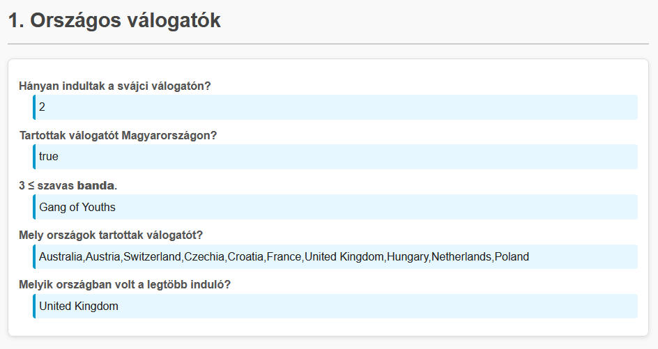
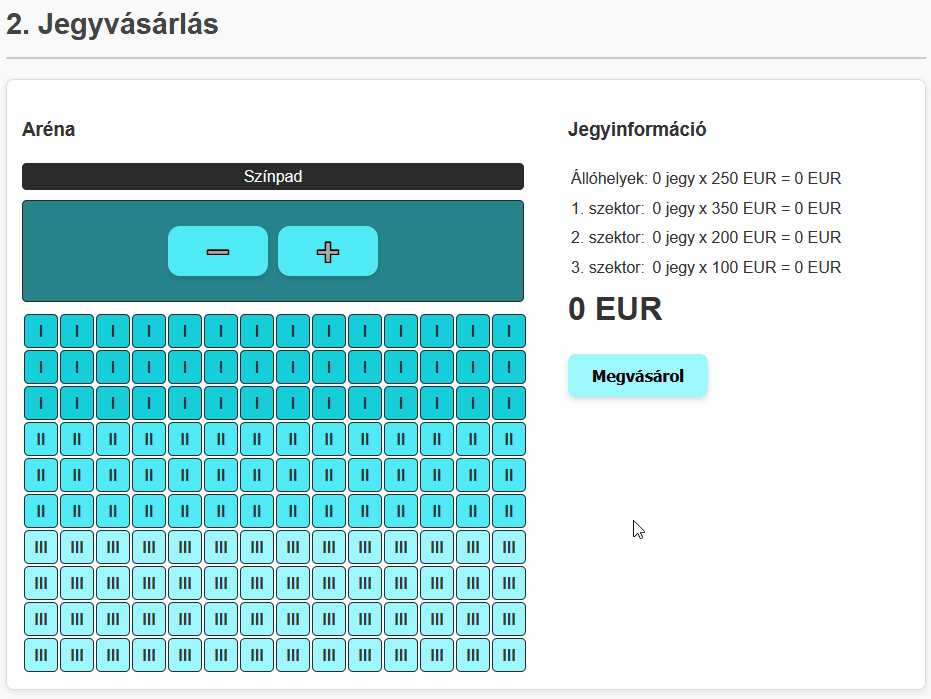
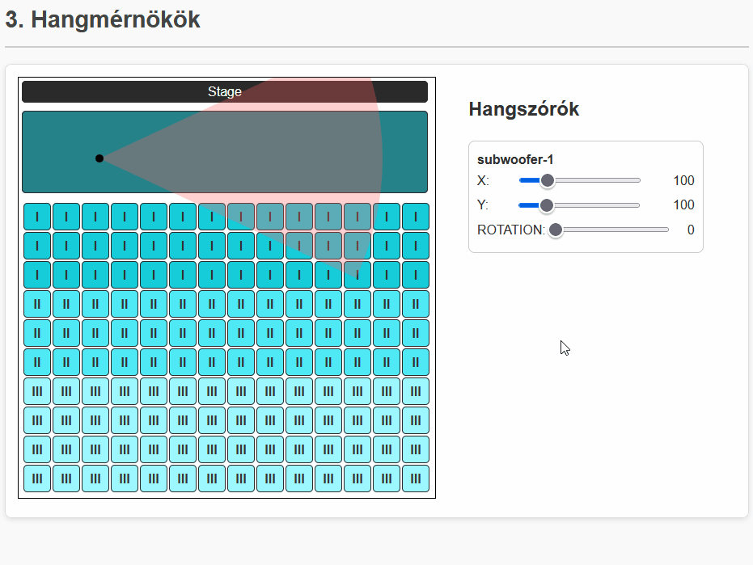
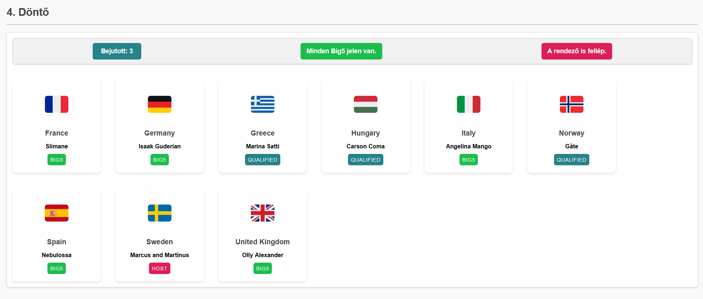
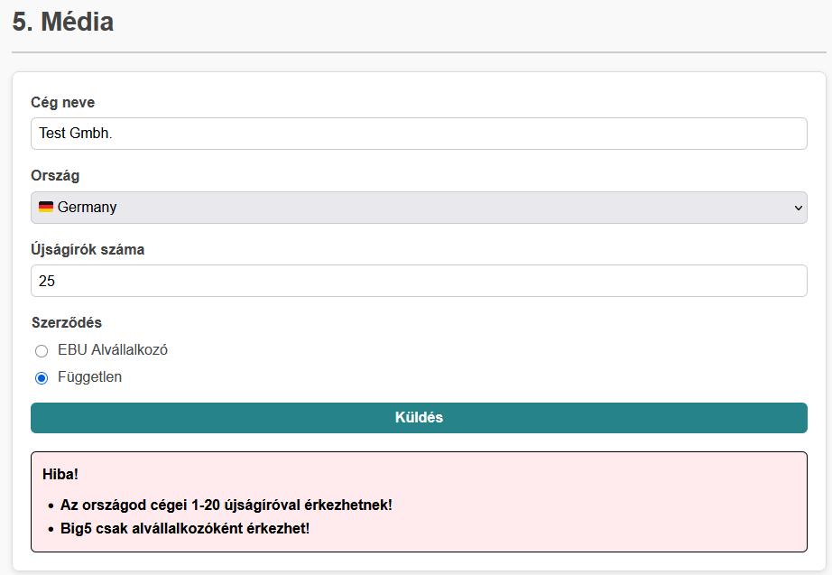
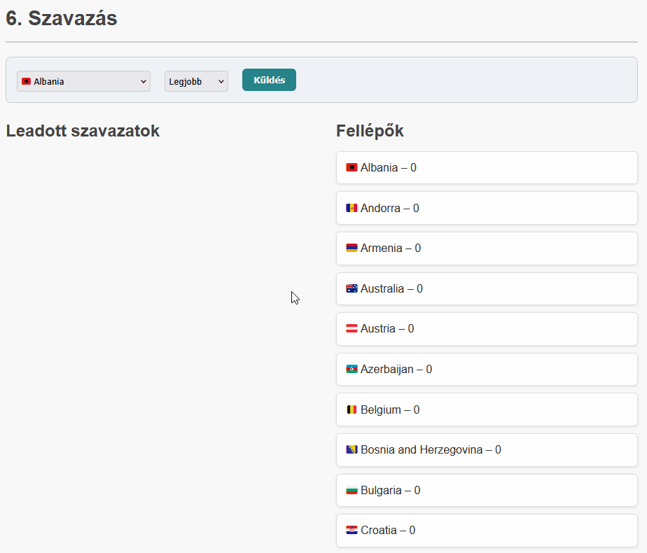

# Évfolyam ZH

## Tudnivalók

### Meddig írhatom?
- A zárthelyi dolgozat **19:30-ig** írható, amely **magába foglalja** a feladatok megoldása mellett: a kiinduló állományok letöltését; a `README` file kitöltését, mely nélkül a megoldás **elégtelen**; a kész megoldás tömörítését és feltöltését. Idő utólagos bővítésére **nincs lehetőség**. 
- A feladatokat a [ZH rendszeren](https://webprogramozas.inf.elte.hu/zh) keresztül kell beadni. A rendszer pontban 19:30-kor lezár. A zárthelyi dolgozat időtartamának **utolsó 10 percében már csak a tömörítéssel és feltöltéssel foglalkozz**! Az utolsó pillanatra hagyott sikertelen feltöltés ugyanúgy elégtelen érdemjeggyel jár.

### Mit használhatok?
- A [ZH rendszerbe](https://webprogramozas.inf.elte.hu/zh) előre feltöltött segédanyagaidat.
- [JavaScript dokumentációt](https://developer.mozilla.org/en-US/).
- [PHP dokumentációt](https://www.php.net/).
- Az [előadások diasorát](https://webprogramozas.inf.elte.hu/webprog/lectures/01/) (a linkben `01` írandó át `01`-`13` közötti számra).

### Mit nem használhatok?
Többek közt:
- Emberi segítség (szinkron, aszinkron, chat, fórum, stb.), kivéve a felügyelőtanároktól történő segítségkérést.
- Mesterséges intelligencia (ChatGPT, Bing AI, GitHub Copilot, AI kódkiegészítést/segítséget tartalmazó VS code kiegészítők. stb.). A telepített kiegészítőid nem-ismerete nem mentesít a következmények alól.
Amennyiben valaminek a használatában bizonytalan vagy, inkább **kérdezz rá nálunk**.

Mindezek elfogadásáról a kezdőcsomagban található `README` fájlban kell nyilatkoznod.

### Mit kell még tudnom?
- A feladatok (1, 2, 3...) nem épülnek egymásra, **tetszőleges sorrendben** megoldhatók. A részfeladatok (a, b, c...) feladaton belül esetenként egymásra épülhetnek, vagy egy korábbi részfeladat megoldása segítheti egy későbbi megoldását – de ettől függetlenül érdemes végigolvasni őket, mert előfordulhat, hogy bár az *a* és *b* feladatot épp nem tudod megoldani valahol, de a *c-e* részfeladatokhoz viszont beugrik a megoldás. Ezen felül javasoljuk, hogy ha elakadsz egy részfeladattal, akkor ne azzal tölts el egy órát, hanem haladj tovább (a következő feladat első pár részfeladata több pontot érhet, mint az az egy részfeladat, amin épp elakadtál).
- A feladatok megoldásához először töltsd le az általunk készített keretprogramot. Ebben minden feladat külön könyvtárban helyezkedik el. Minden könyvtárban előkészítettük a HTML, CSS, JavaScript, PHP állományokat. Ezekben dolgozz! A kliensoldali feladatokban általában csak a `.js` fájlhoz kell hozzányúlni, de ha kell, akkor a HTML is módosítható, sőt több `.js` fájlra is szétoszthatod a megoldásodat, de ez egyáltalán nem elvárás.
- A letöltött keretprogramban lévő `README` fájlba írd be a Neptun kódodat és a nevedet! **A megfelelően kitöltött `README` állomány nélküli megoldásokat nem értékeljük!**
- Minden feladat könyvtárában találsz egy `TASKS.md` fájlt. Ezekben az egyes `[ ]` közötti szóközt cseréld le `x`-re azoknál a részfeladatoknál, amiket sikerült (akár részben) megoldanod! Ez segít nekünk abban, hogy miket kell néznünk az értékeléshez.
- Mindenképpen telepítsd a PHP-t a gépre: [Tóta Dávid telepítője](https://github.com/totadavid95/PhpComposerInstaller/blob/master/README_hu.md)

## Lore
Szombaton véget ért a 2025-ös Eurovíziós Dalfesztivál, melynek nyertese Ausztria, így a jövő évi verseny helyszíne előreláthatólag Bécs lesz. A szervezők már meg is keresték a híres ELTE IK-t, hogy az informatikai infrastruktúra maradéktalan állapotban várja a 2026-os évet.

## JavaScript feladatok

### 1. Országos válogatók (js-1-selections, 10 pont)
Az Eurovízió válogatókat minden ország magának rendezi. Segíts az Eurovízió szervezőknek, hogy tudják, melyik országban mekkora volt a show! A feladatokat **ne beégetve oldd meg, hanem programozottan**, hiszen a szervezők még nem rendelkeznek a tényleges jövő évi indulók listájával!

*Az `index.js` fileban eléred a `participants` változót, amit a `participants.js` fileban definiáltunk, és a `nations` változót, amit a `nations.js` fileban definiáltunk. A `participants` tömb országok szerint rendezett.*

- a. (1 pont) A `taskA` azonosítójú elembe írd ki, hogy hányan indultak a svájci (`CHE`) válogatón!
- b. (1 pont) A `taskB` azonosítójú elembe írd ki, hogy Magyarország (`HUN`) tartott-e válogatót! (Másképp: Van induló magyar színekben?)
- c. (2 pont) A `taskC` azonosítójú elembe adj meg egy olyan induló bandát (`type`: `band`), aminek a neve legalább három szóból áll! (Másképp: Van benne minimum két szóköz.)
    - Feltételezheted, hogy van ilyen.
- d. (3 pont) A `taskD` azonosítójú elembe sorold fel azokat az országokat, akik tartottak válogatót! (Másképp: Listázd a `participants`-ban szereplő országokat.)
    - Ország**kódok** ismétlődésekkel: 1 pont
    - Ország**nevet** használva (`CHE` -> `Switzerland`): +1 pont
    - Ismétlődések nélkül (akár kóddal, akár névvel): +1 pont
- e. (3 pont) A `taskE` azonosítójú elembe írd ki, hogy melyik országból indult a legtöbb versenyző!
    - Maximum kiválasztás: 2 pont
    - Ország**nevet** használva (`CHE` -> `Switzerland`): +1 pont



### 2. Jegyvásárlás (js-2-ticket, 15 pont)
A 2026-os Eurovíziót Bécs egyik híres stadionjában fogják megrendezni. A jegyvásárlás egy különösen kényes pontja a rendezvénynek. A nézőtér több szektorra van osztva; valamint a színpad előtt csak állóhelyek találhatók. Minden szektorban más a jegyek ára.

- a. (1 pont) A `cost-info` azonosítójú táblában jelezd az egyes szektorok jegyeinek árát!
    - A `sector-0-cost`, `sector-1-cost`, `sector-2-cost`, `sector-3-cost` azonosítójú elemekbe kell beírnod a `sectorCosts` tömb értékeit.
    - A tömbindexek megegyeznek az árhoz tartozó szektor számával (pl.: `0` -> `#sector-0-cost`).
- b. (1 pont) A plusz gomb (`add-standing` azonosító) megnyomására növeld a megvásárolni kívánt állóhelyek számát a `cost-info` azonosítójú táblában!
    - A `sector-0-amount` azonosítójú elemben jelzed a jegyek számát!
    - A `sector-0-total` azonosítójú elembe számold ki az árat is! (`total = amount * cost`)
    - A mínusz gomb (`sub-standing`) hasonlóan működjön lefelé, de ne lehessen negatív számú jegyet venni!
- c. (3 pont) Generáld ki az ülőhelyeket a `seating` azonosítójú táblázatba!
    - Az ülőhelyeket 10 sornyi, 14 oszlopnyi `td` elem reprezentálja.
    - Minden ülőhelyre alkalmazd a `seat` stílusosztályt!
    - Az első 3 sor székeire alkalmazd a `sector-1` stílusosztályt, a következő 3 sor székeire a `sector-2` stílusosztályt, a maradékra a `sector-3` stílusosztályt!
    - *Ha nem tudod megoldani ezt a részfeladatot, de a többit megpróbálnád, illeszd be a `seating.html` fileban található HTML-t a `#seating` táblába, és haladj tovább.*
- d. (2 pont) Az ülőhelyeket lehessen kijelölni!
    - Ha rákattintunk egy ülőhelyre a `seating` táblázatban, alkalmazd rá a `selected` stílusosztályt!
    - Ha egy már kijelölt ülőhelyre kattintunk, vedd le róla a `selected` stílusosztályt!
- e. (3 pont) A kijelölt ülőhelyeket tartsd frissen a `cost-info` azonosítójú táblában!
    - Frissítsd a lefoglalt jegyek számát és árát!
    - Minden szék a szektorának megfelelő sort frissítse!
    - Ha levesszük a kijelölést egy székről, a táblázatban is csökkenjenek a számok!
- f. (1 pont) Tartsd frissen a végösszeget (`total` azonosítójú elem)!
- g. (2 pont) A `purchase` azonosítójú gomb megnyomásával megvásároljuk a jegyeket.
    - A `cost-info` táblát és a `total` végösszeget állítsd alaphelyzetbe!
    - A kijelölt ülőhelyekre alkalmazd a `taken` stílusosztályt, és töröld a `selected` stílusosztályt róluk!
- h. (1 pont) Foglalt (`taken` stílusosztályú) ülőhelyet ne lehessen kijelölni!



### 3. Hangmérnök (js-3-soundengineer, 11 pont)
Az Eurovízió legfontosabb technikusai talán épp a hangmérnökök, hisz egy koncertet az "épphogy csak nem jó" hangzás is már teljesen tönkretehet.

*A kódban nem neked kell a háttérműködést megírni, azt mi biztosítjuk a kiinduló kóddal. A te feladatod, hogy a `drawScene` és a `drawSpeaker` függvényeket kiegészítsd, és ezzel a háttérben tárolt modellt megjelenítsd.*

Segítség a megoldáshoz: `context.arc(x, y, r, start, end)` függvény.
```js
// x, y: A kör középpontjának koordinátái
// r: A kör sugara
// start, end: A körív/körcikk/körszelet kezdő- és végszöge radiánban. Pl.: 0, Math.PI, 2*Math.PI

context.arc(0, 0, 15, 0, Math.PI) // Egy (0,0) középpontú, 15 sugarú félkör. A teljes kör 2 pí radián lenne.
```

- a. (1 pont) `drawScene`: A függvény minden meghívásakor töröld ki a `canvas` elem tartalmát!
- b. (1 pont) `drawScene`: A függvény minden meghívásakor rajzold ki a `canvas` elembe a `backgroundImage` képet a `(0,0)` pozícióba. (Ez lesz a háttér.)
- c. (1 pont) `drawSpeaker`: Az `x` és `y` paramétereket felhasználva rajzolj ki ki egy 5 sugarú teli fekete pöttyöt az `(x,y)` pontba!
    - Ha jól csináltad, az oldalsó "subwoofer-1" csúszkáival már mozgatni is tudod a pöttyöt.
- d. (1 pont) `drawSpeaker`: Rajzolj mégegy kört az `(x,y)` pontba! Ennek színe legyen piros, a sugara pedig a `range` paraméter értéke legyen!
    - Ha a piros kör kitakarja a fekete pöttyöt, ne ijedj meg, csak cseréld meg a rajzolás sorrendjét.
    - Ennek a piros körnek pont a fekete pötty lesz a középpontja.
    - A kör nagyrésze ki fog lógni a képből, ez nem probléma.
- e. (3 pont) `drawSpeaker`: A piros kör ne legyen teljes kör, hanem csak egy körszelet. A méretében a `cone` és `rotation` paraméterek fognak segíteni.
    - A körcikk kezdete a `(rotation - cone / 2) * pí` szög lenne, de ezt még `180`-cal el kell osztani, hogy áthidaljuk a fokok és radiánok közti átváltást.
    - A körcikk vége hasonló, csak hozzáadjuk a `cone / 2`-t, nem kivonjuk (hiszen ez a másik fele).
    - Ha mindent jól csináltál, nem egy rendes körcikket kaptál, csak egy kis körszeletet; illetve a rotation csúszkával már forgatni is tudod a furcsa szeletet.
- f. (2 pont) `drawSpeaker`: Az `(x,y)` pontból indulva rajzold meg a teljes kúp formát.
    - *Ha az e. részfeladat nem sikerült, ezt egy sima háromszöggel is megoldhatod, de ez esetben a piros kört kommenteld ki, hogy átlátható maradjon a megjelenített canvas-ed!*
    - Érdemes a `beginPath`, `moveTo`, `arc` és `closePath` függvényeket összekötve használni, de más megoldás is létezik.
    - Ha jól csináltad, itt már megjelenik a rendes körcikk és minden csúszka az elvárt viselkedést tanusítja.
- *Ezen a ponton írd át a 8. sorban a `simpleMode` változó értékét hamisra!*
- g. (2 pont) `drawSpeaker`: A `type` paramétertől függően más-más színűek legyenek az eddig piros kúpok!
    - `subwoofer`: `rgba(255, 100, 100, 0.3)`
    - `midrange`: `rgba(100, 255, 100, 0.3)`
    - `tweeter`: `rgba(100, 100, 255, 0.3)`



## PHP feladatok

### 4. Döntő (php-4-final, 10 pont)
Az Eurovízió döntőjébe három módon lehet bekerülni.
1. A rendező ország indulója automatikusan bekerül.
2. Franciaország, Németország, Olaszország, Spanyolország és az Egyesült Királyság indulói automatikusan bekerülnek.
3. Mindenki másnak a kieséses szakaszban kell bejutnia elég szavazatot gyűjtve.
Segíts, hogy a nézők átlássák az indulókat, és hogy azok hogyan kerültek be a döntőbe!

*Használd az induló kódban található elemeket mintaként! Ha megvagy a feladatokkal, a kiinduló (beégetett) kártyákat töröld ki!*

- a. (1 pont) Listázz ki annyi `card` stílusosztályú `div` elemet a `#main` elembe, ahány induló fellép a döntőben!
- b. (1 pont) A kártyák `.flag`, `h2` és `.contestant` elemeibe helyezd el a versenyzők zászlóját, országát és nevét!
- c. (1 pont) A kártyák `.method` elemeibe írd ki, milyen módon jutott ki a versenyző!
    - `big5`: `Big5`
    - `qualified`: `Bejutott` (vagy `Qualified`)
    - `host`: `Rendező` (vagy `Host`)
- d. (2 pont) Alkalmazd minden kártyára a bejutás módjának stílusosztályát!
- e. (1 pont) Az `#information > #qualified` elembe írd ki, hányan jutottak be az elődöntőkön! (Másképp: Hány `qualified` döntős van?)
- f. (1 pont) Az `#information > #big5` elembe írd ki, hogy minden Big5 ország jelen van (`Minden Big5 jelen van.`), vagy valamelyikük nem vesz részt (`Hiányos Big5!`).
    - *Feltételezheted, hogy az adatok helyesek, nincsenek hamis értékek, duplikációk - tehát elég a mennyiséget vizsgálni.*
- g. (1 pont) Az `#information > #host` elembe írd ki, hogy a rendező is indít-e fellépőt (`A rendező is fellép.`) avagy sem (`A rendező nem indít versenyzőt!`).
- h. (2 pont) A kártyák legyenek az ország neve szerint ABC sorrendben!
    - *Megoldás lehet például az* `usort` *és* `strcmp` *függvények együttes használata.*



### 5. Média regisztráció (php-5-media, 12 pont)
Bár a nagy médiacégek előre megegyeznek a szervezőkkel a személyzetet illetően, kisebb vállalkozások, hírszolgáltatók is előszeretettel küldenek fotósokat, riportereket. Nekik regisztrálni kell egy űrlapon.

*Validáld az űrlap helyességét elküldést követően szerveroldalon! (Tehát nem szabad beépített HTML/JS validációt használni, hanem PHP-t kell írni.)* **Teljes pont akkor jár egy-egy részfeladatra, ha az adott hiba kiírásra is kerül, egyébként csak az adott pont fele kapható!** *Az `#errors` div használata nem kötelező, a hibákat más módon is kiírhatod, például közvetlen az input mezők után, de az oldal első betöltésekor ne jelenjenek meg hibák! Érdemes lehet az állapottartást és hibakiírást az elején megírnod, hiszen utána könnyebb lesz ellenőrizned a megoldásod.*

- a. (2 pont) Minden mezőt kötelező kitölteni.
- b. (1 pont) A cégnév minimum 3 karakter hosszú.
- c. (1 pont) Az ország csak a megadott listabeli ország lehet (`$nations` változó).
- d. (1 pont) Az újságírók száma egész szám. (Nem szöveg, nem tizedes.)
- e. (1 pont) Az újságírók száma alapesetben legalább 1, legfeljebb 10.
- f. (1 pont) Az újságírók száma Big5 országból (`'GBR', 'ITA', 'ESP', 'DEU', 'FRA'`) legfeljebb 20 lehet egy cégnél.
- g. (1 pont) A szerződés csak `subsidiary` vagy `independent` lehet.
- h. (1 pont) A szerződés típusa Big5 esetében kötelezően `subsidiary` típusú.
- i. (2 pont) Az űrlap állapottartó.
- j. (1 pont) A `success` azonosítójú `div` elem megjelenítését tedd feltételessé úgy, hogy csak hibátlanul kitöltött űrlap esetén jelenjen meg! Ilyenkor az `errors` mező ne jelenjen meg!

Hibaüzenetek (nem kötelező pont ezeket használni):
```
A cég nevének megadása kötelező!
A bejegyzett ország megadása kötelező!
Az újságírók számának megadása kötelező!
A szerződés típusát kötelező kiválasztani!
A cég neve legalább 3 betű legyen!
Ismeretlen ország!
Az újságírók száma egész szám legyen!
Az országod cégei 1-10 újságíróval érkezhetnek!
Az országod cégei 1-20 újságíróval érkezhetnek!
Ismeretlen szerződéstípus!
Big5 csak alvállalkozóként érkezhet!
```



### 6. Szavazás (php-6-vote, 14 pont)
Az egyik legizgalmasabb dolog az Eurovízión a szavazás... de az már le is zárult. Ideje felvinni a pontokat az adminisztratív rendszerbe, ami még sokkal izgalmasabb! A (valósához képest leegyszerűsített) pontosztás így fog kinézni:
- Minden szavazat lehet "Legjobb", "Nagyon jó" vagy "Jó".
- A "Legjobb" 12 pontot ér, a "Nagyon jó" 8 pontot", a "Jó" 5 pontot.

Segíts elkészíteni a szavazat adminisztráló rendszert!

- a. (2 pont) Legyen lehetőség új szavazatot adminisztrálni. Ezt mentsd el fileba.
    - Nem kell ellenőrzést végezned, feltételezheted, hogy az űrlap helyesn lesz kitöltve.
    - A mentést követően újra a lista oldalára kerüljünk, ahol már az új adat is szerepel!
- b. (2 pont) Listázd ki a fájlban szereplő szavazatokat a mintának megfelelően!
- c. (3 pont) Legyen lehetőség szavazatot törölni.
- d. (3 pont) Számold össze a fellépők pontjait:
    - Minden "Legjobb" szavazat 12 pontot ér.
    - Minden "Nagyon jó" szavazat 8 pontot ér.
    - Minden "Jó" szavazat 5 pontot ér.
    - *Ezt nem kell fileban tárolni, de ha szeretnéd, lehet.*
- e. (1 pont) Listázd a fellépőket a mintának megfelelően pontjaikkal együtt!
    - *Nem számít, hogy a nulla pontos országokat listázod vagy sem.*
- f. (3 pont) A fellépők a pontjaik szerint csökkenő sorrendbe legyenek rendezve!
    - *Segítségedre lehet az* `usort` *függvény.*

